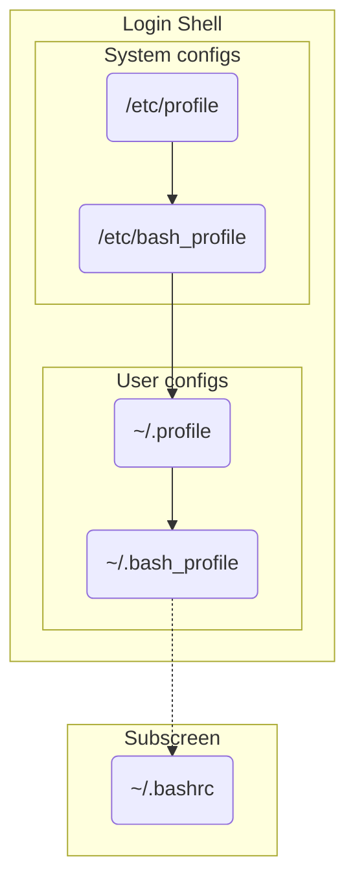

## Login shell

- 使用 su 切換使用者

## Subshell

- screen
- tmux

## /etc/profile

全部的使用者的 login shell 都會讀取，包含 bash, zsh, etc.

## /etc/bash_profile

全部使用者的 bash login shell 會讀取

<!-- markdownlint-disable MD033 -->
<h2> ~/.profile </h2>  
<!-- markdownlint-enable MD033 -->
  
個別使用者的 login shell 會讀取，包含 sh, bash, zsh

## ~/.bash_profile

個別使用者的 bash login shell 會讀取

## ~/.bashrc

開啟 subshell 會讀取

## References

- <https://serverfault.com/questions/261802/what-are-the-functional-differences-between-profile-bash-profile-and-bashrc>
