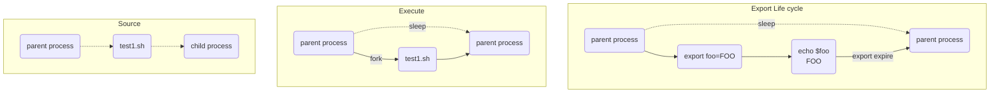

## source

使用 source 執行 shell script 會直接沿用目前的進程。

```bash
source hello-world.sh
```

## excute

直接執行 shell script 會開啟一個子進程

```bash
./hello-world.sh
```

## export

將某個變數變成環境變數，Life cycle 為這個進程結束為止

## diagram



## References

- <https://superuser.com/questions/176783/what-is-the-difference-between-executing-a-bash-script-vs-sourcing-it>
