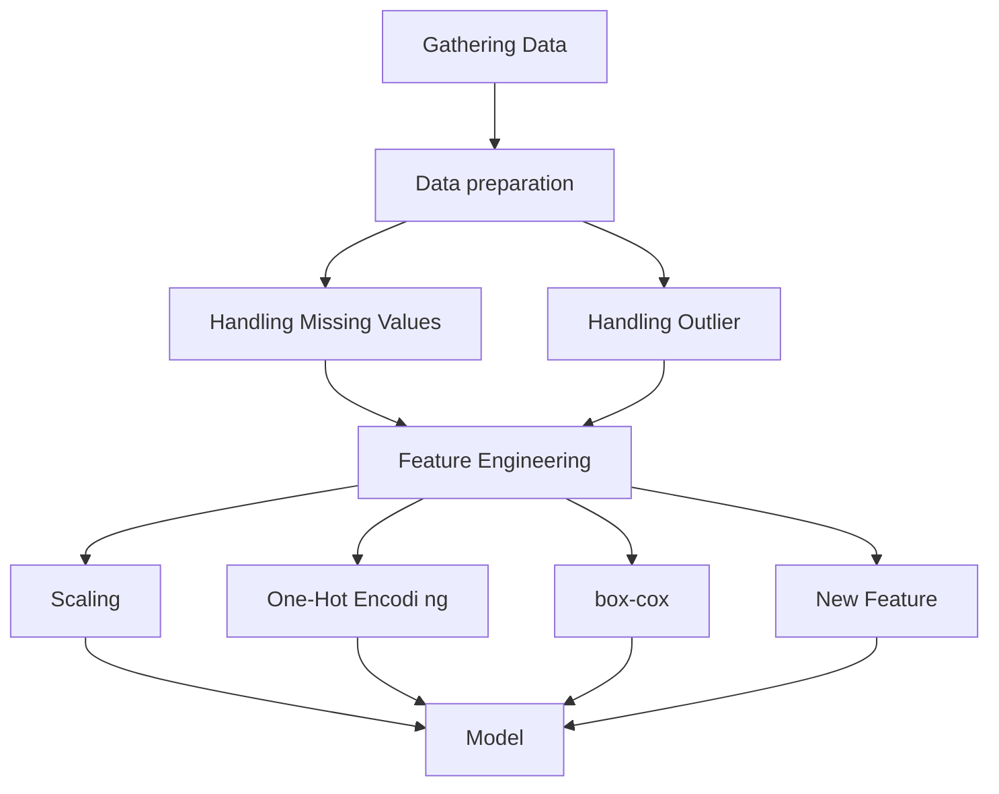

## Machine Learning Categories

## Gathering Data

## Data preparation

### Data Preprocessing 資料預處理

- Handling Missing Values
- Outlier
- Feature Engineering

## Model & HyperParameter 模型及超參數

## Loss Function 損失函數

## Activation Function 激活函數

